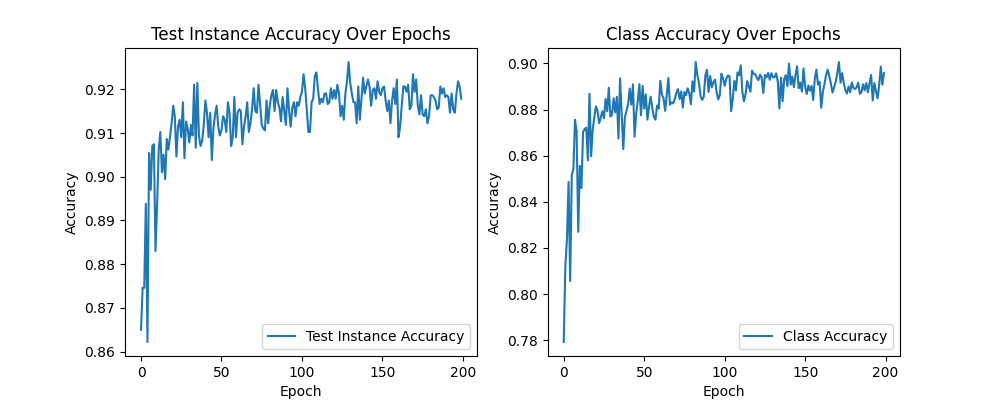
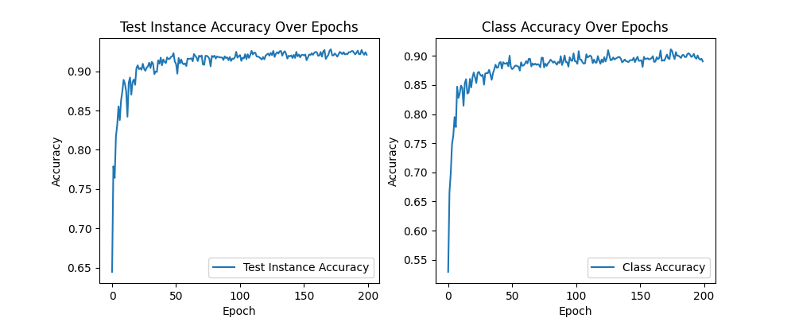
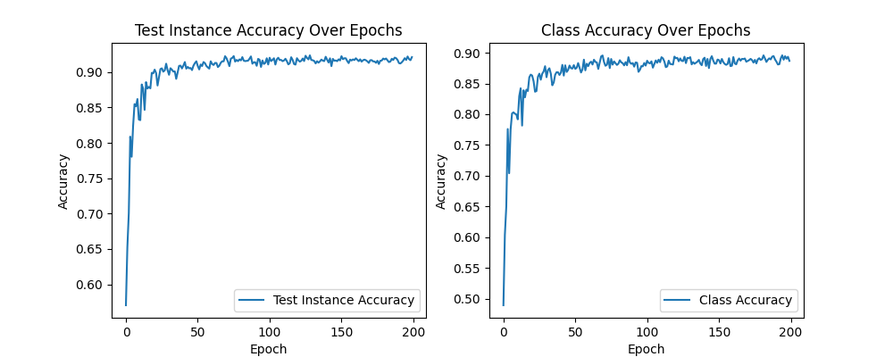
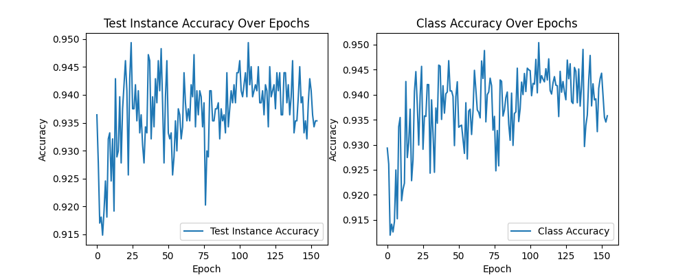
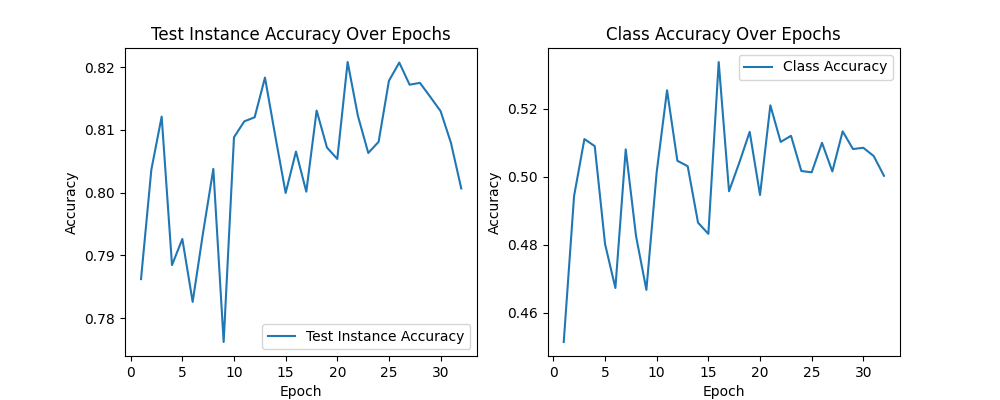
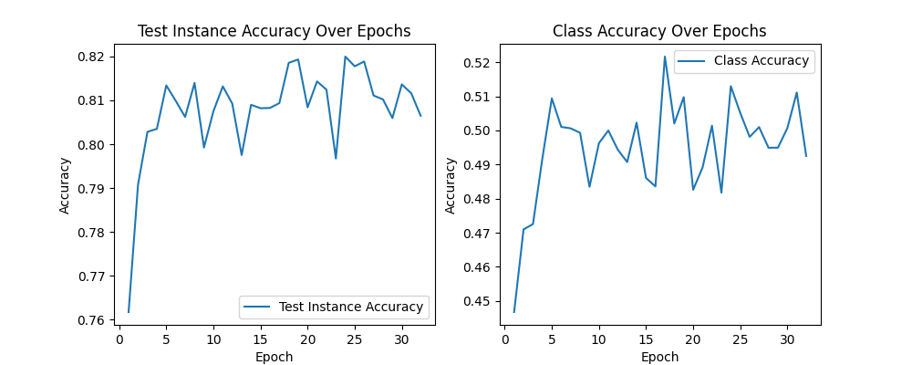

# result of pointnet & pointnet++

# Classification

The classification algorithm can use either ModelNet10 or ModelNet40. It allows the choice of whether to use the normal features of points (—use_normals) and the sampling method, such as uniform sampling (—use_uniform_sample). I have chosen several options for training.

| ModelNet | Method | Test Instance Accuracy | Class Accuracy |
| --- | --- | --- | --- |
| 40 | basic | 0.924279 | 0.891787 |
| 40 | with normal features | 0.891787 | 0.891787 |
| 40 | with uniform sampling | 0.922276 | 0.889164 |
| 10 | basic | 0.947198 | 0.945434 |

## Accuracy variation curves(According to the order in the table above)

# **Part Segmentation (ShapeNet)**

eval mIoU of Airplane       0.822105
eval mIoU of Bag            0.773953
eval mIoU of Cap            0.823337
eval mIoU of Car            0.788797
eval mIoU of Chair          0.908672
eval mIoU of Earphone       0.774496
eval mIoU of Guitar         0.911501
eval mIoU of Knife          0.876008
eval mIoU of Lamp           0.838147
eval mIoU of Laptop         0.955814
eval mIoU of Motorbike      0.718066
eval mIoU of Mug            0.950532
eval mIoU of Pistol         0.809336
eval mIoU of Rocket         0.600681
eval mIoU of Skateboard     0.766923
eval mIoU of Table          0.824887
Accuracy is: 0.94289
Class avg accuracy is: 0.86904
Class avg mIOU is: 0.82145
Inctance avg mIOU is: 0.85188

.png)

# **Semantic Segmentation (S3DIS)**

class ceiling , IoU: 0.900
class floor , IoU: 0.979
class wall , IoU: 0.734
class beam , IoU: 0.000
class column , IoU: 0.085
class window , IoU: 0.590
class door , IoU: 0.088
class table , IoU: 0.690
class chair , IoU: 0.77
class sofa , IoU: 0.482
class bookcase , IoU: 0.619
class board , IoU: 0.579
class clutter , IoU: 0.438

eval point avg class IoU: 0.535538
eval whole scene point avg class acc: 0.619653
eval whole scene point accuracy: 0.826357

**batch size=16**

**batch size=32**

