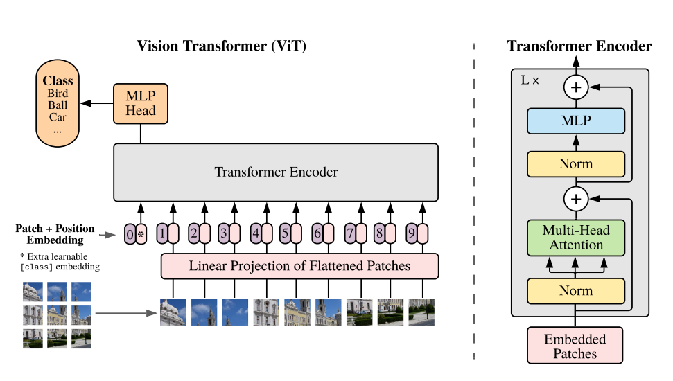

# Vision Transformer
1. Simple realization of Vit(only multi-attention in torch)
2. Simple realization of Vit(all modules from torch)
3. Directly use nn.VisionTransformer
4. Train with pretrained torchvision weights
5. A simple spatial attention to visulize a ROI heatmap

